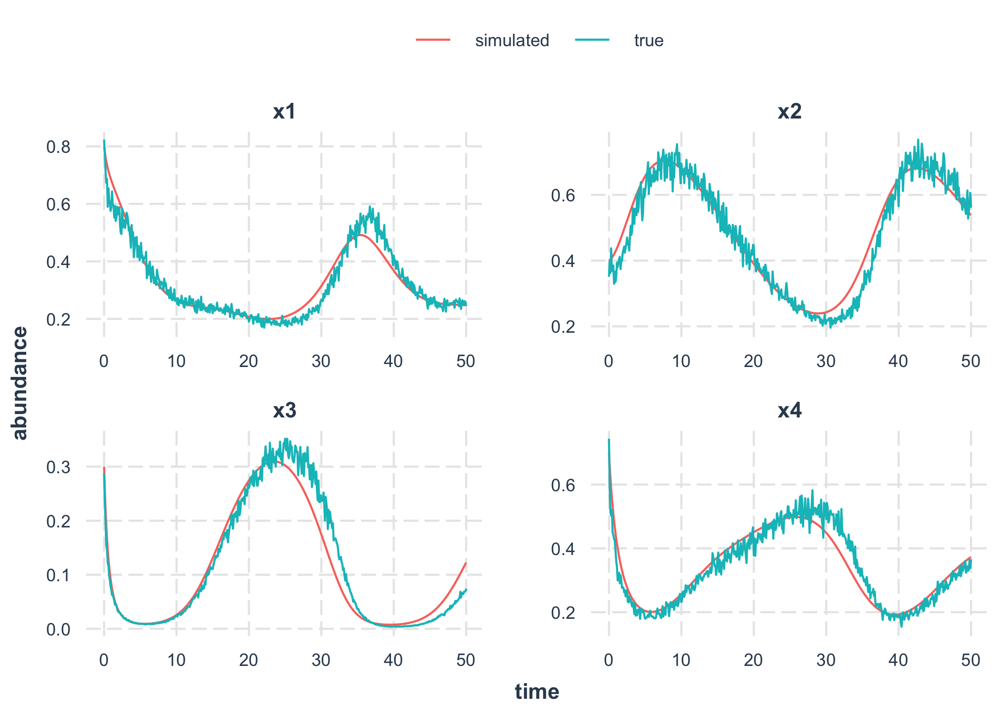

<!-- README.md is generated from README.Rmd. Please edit that file -->

# InferInteractions

<!-- badges: start -->
<!-- badges: end -->

The goal of InferInteractions is to …

## Installation

You can install the development version of InferInteractions from
[GitHub](https://github.com/) with:

``` r
# install.packages("devtools")
devtools::install_github("clsong/InferInteractions")
```

## Example

This is a basic example which shows you how to solve a common problem:

``` r
suppressPackageStartupMessages(library(tidyverse))
library(topodetective)
#> Registered S3 method overwritten by 'tune':
#>   method                   from   
#>   required_pkgs.model_spec parsnip

get_classic_dynamics("4_species_chaos") # choose a population dynamic

ts <- generate_time_series(eqns_per, time_range, state_initial, species_num) # simulate a dynamic

# plot_time_series(ts)
```

We then infer system parameters from time series alone. We choose all
possible topologies.

``` r
reg_model <- choose_regression_model("linear")

fitted_models <- ts %>%
  differentiate_ts() %>%
  group_split(species) %>%
  map(fit_interaction_parameters) %>%
  bind_rows(.id = 'species') %>%
  mutate(species = paste0("x", species))
```

We then simulate the dynamics with the inferred parameters. We compare
the fit.

``` r
set.seed(123)
topology_fitted <- fitted_models %>%
  filter(R2 > .9) %>%
  group_by(species) %>%
  sample_n(1) %>%
  ungroup()

ts_simu <- simualte_fitted_dynamics(topology_fitted)
evaluate_fit(ts, ts_simu)
#> [1] 0.01749783

plot_true_vs_simu(ts, ts_simu)
```


